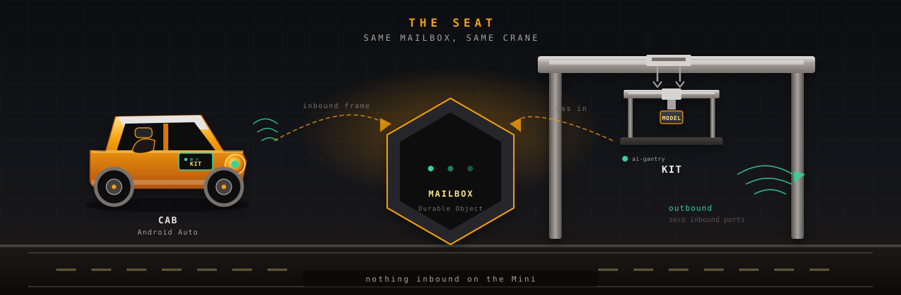
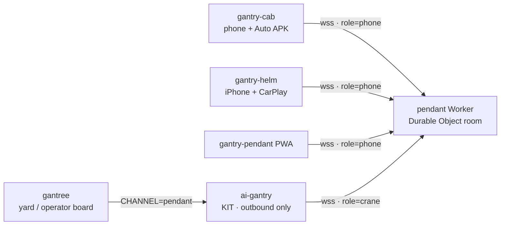
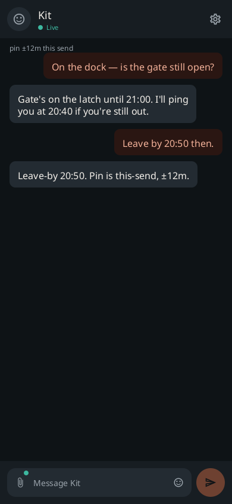
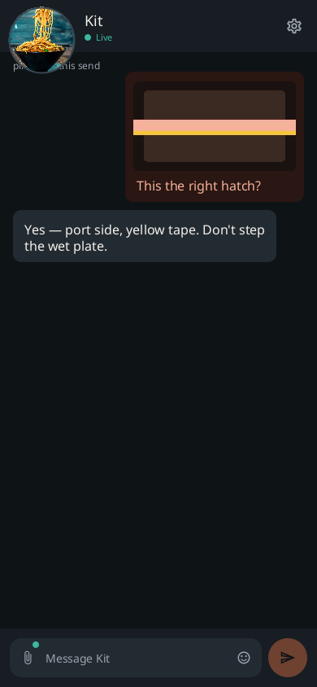
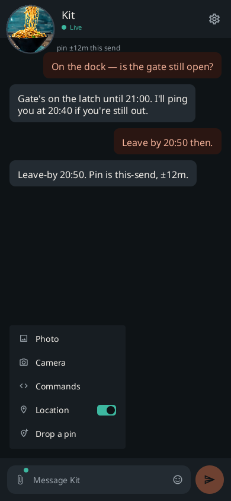
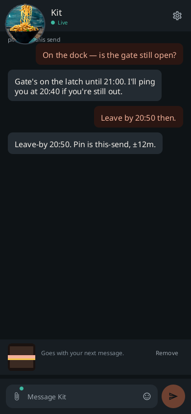
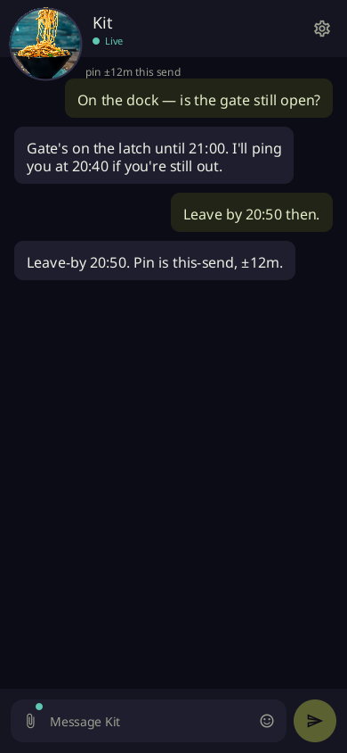
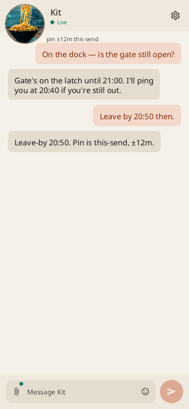
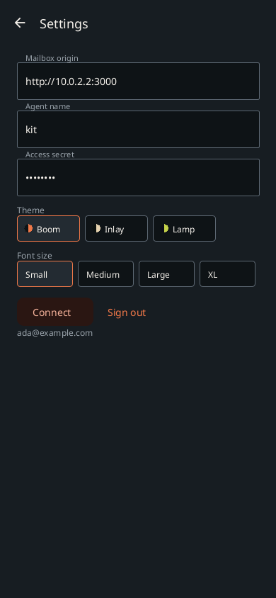
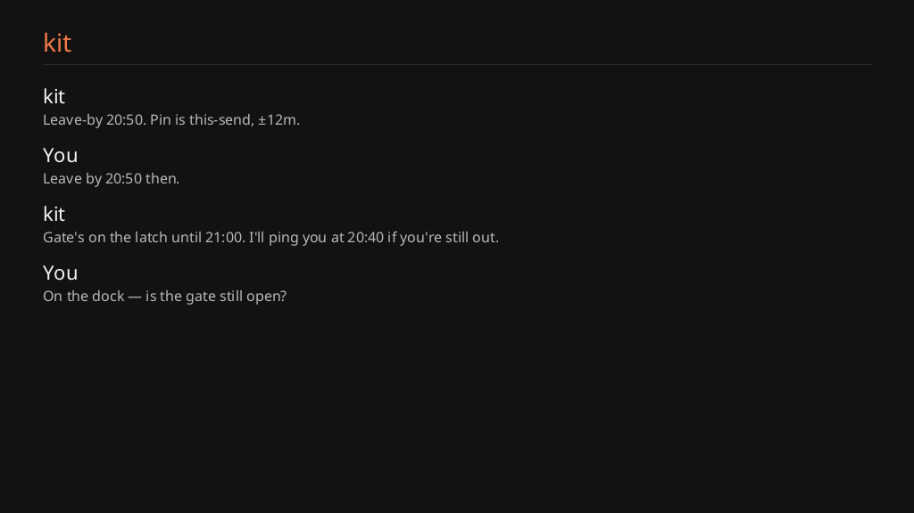

#  gantry-cab

<p align="center">
  
</p>

<p align="center">
  <a href="https://github.com/shotah/gantry-cab/actions/workflows/ci.yml"></a>
  <a href="https://github.com/shotah/gantry-cab/actions/workflows/ci.yml"></a>
  <a href="https://github.com/shotah/gantry-cab/releases"></a>
  <a href="LICENSE"></a>
</p>

> **gantry** *(n.)* — the rigid frame that holds and positions tools.
>
> **cab** *(n.)* — the seat on that crane. You sit in the car. You still
> talk to the same crane.

[gantry-pendant](https://github.com/shotah/gantry-pendant) is the
handheld: a Vinext PWA and the Durable Object mailbox. **This APK is
the seat** — the phone in your pocket, and Kit as a message card over
maps. Same room. Same [ai-gantry](https://github.com/shotah/ai-gantry)
crane. The Mini still opens **zero** inbound ports.
[gantree](https://github.com/shotah/gantree) is the yard board. It
does not sit in a chat turn.
[gantry-helm](https://github.com/shotah/gantry-helm) is the iPhone
sister — same mailbox, CarPlay message cards.

```text
gantry-cab APK  ─┐
gantry-helm IPA ─┤
pendant PWA     ─┼─►  pendant Worker (Durable Object)  ◄──  ai-gantry (outbound)
                 │
gantree writes CHANNEL=pendant. It never sits in the turn.
```



Android Auto reads Kit aloud and stuffs spoken replies into
`RemoteInput`. Cab turns that string into an `inbound` frame. It does
not wrap the Vinext PWA. It does not run React Native.

Paperclip is the rest of the mouth: photo or camera (caption + JPEG
travel together), slash commands, GPS on send, drop a pin. Kit can
pick the room's mood; you can unfollow and keep yours. Boom is the
default. Lamp and Paper are the other two on this page — Settings has
the full catalog.

<p align="center">
  
  &nbsp;
  
  &nbsp;
  
  &nbsp;
  
</p>

<p align="center">
  
  &nbsp;
  
  &nbsp;
  
  &nbsp;
  
</p>

Every screen: [docs/screens.md](docs/screens.md). `make shot` reshoots.
Phone + Auto install: [docs/sideload_to_android.md](docs/sideload_to_android.md).
Make the car talk: [docs/android_auto_setup.md](docs/android_auto_setup.md).
Open work: [docs/todo.md](docs/todo.md). Mailbox handoff:
[docs/pendant_handoff.md](docs/pendant_handoff.md). FCM (public-scale,
not this beta): [docs/fcm_design_and_todo.md](docs/fcm_design_and_todo.md).

| Repo | Job |
| --- | --- |
| **gantry-cab** | This APK. Pocket thread + Auto message cards. |
| [gantry-helm](https://github.com/shotah/gantry-helm) | iOS app. Pocket thread + CarPlay message cards. |
| [gantry-pendant](https://github.com/shotah/gantry-pendant) | Mailbox Worker + handheld PWA. One room per crane slug. |
| [ai-gantry](https://github.com/shotah/ai-gantry) | The crane. `CHANNEL=pendant`. Dials **out**. |
| [gantree](https://github.com/shotah/gantree) | The yard. Writes env and files. Not a mouth. |

## This is not

- A Chrome Install / TWA / PWA in the dash. Auto will not project that.
- A Play Store listing (sideload or Play **internal** testing).
- A second mailbox. Forking the Worker is how you get two rooms.

## Talks to pendant

| Call | What |
| --- | --- |
| `GET /api/auth/config` | spike vs Google |
| `POST /api/auth/token` | `{ id_token, nonce }` → session JWE |
| `GET /api/auth/me` | `Authorization: Bearer <jwe>` → `{ sub, email, cranes }` |
| `GET /ws/<slug>?role=phone` | WebSocket. Header is the JWE (Google) or the spike secret |

Spike walk: emulator → `http://10.0.2.2:3000`, paste the mailbox
secret. Production: copy pendant’s **Web** client id into
`CAB_GOOGLE_WEB_CLIENT_ID`, and create a **new Android** OAuth client
(package `com.gantree.cab` + SHA-1, no redirect URI). Cab POSTs the
token to `/api/auth/token` — Google is not given a Cab callback.

## Hello

Android Studio works. So does make, same shape as
[ai-gantry](https://github.com/shotah/ai-gantry):

```bash
make test            # script tests + JVM unit tests
make lint            # Android lint
make coverage        # JaCoCo + 70% bar (mailbox + mouth)
make check-app       # lint + test + coverage (one Gradle invocation)
make install-hooks   # pre-commit: tests; pre-push: lint + coverage
make watch           # continuous mailbox JVM tests
make shot            # phone + Auto PNGs → assets/docs
make build           # debug APK
make apk             # sideload APK (GitHub Release uses this)
make release         # bump patch, tag, push (GitHub Release + APK)
make release DRY_RUN=1
```

Needs JDK 21 and an Android SDK (`local.properties` `sdk.dir`, or
`ANDROID_HOME`). Script tests (`make test-scripts`) do not. Nested checkout under
gantree (`repos/gantry-cab`), own git remote, same pattern as
`repos/ai-gantry`. Walk: [docs/setup.md](docs/setup.md).

```bash
# on the pendant checkout
npm run dev          # 127.0.0.1:3000 — emulator reaches it as 10.0.2.2
```

In cab: origin `http://10.0.2.2:3000`, slug `kit`, spike secret from
`.dev.vars`. Type. Reply in the crane tab. Auto: Desktop Head Unit
for the `ConversationItem` screen; a real head unit only gets the
message cards (Android Auto → Developer settings → Unknown sources).

Google Sign-In needs **two** OAuth clients in pendant’s GCP project:
the existing **Web** client id in `CAB_GOOGLE_WEB_CLIENT_ID` (copied
from pendant — that is the token `aud`), and a **new Android** client
(`com.gantree.cab` + this APK’s SHA-1 from the GitHub Release notes).
The Android client has **no** redirect URI. Cab never opens Chrome;
it POSTs the ID token to the mailbox `/api/auth/token`. Walk:
[docs/setup.md](docs/setup.md#google-production-worker). GitHub
Release bakes the Web id from Actions secrets. The public tree only
has fake example hosts.

## Auto

Notification messaging (`MessagingStyle` + reply + mark-as-read) is
the car. Kit's reply is a message card over maps or music; Auto reads
it and takes a spoken reply. That is the whole sideload story — Auto's
**Unknown sources** switch admits notifications from a non-Play APK,
and nothing else.

The `ConversationItem` screen (`CabCarAppService`, Car API 7) is real
but only reachable on the Desktop Head Unit or a Play internal-testing
install: Google's unknown-sources toggle "doesn't apply to apps built
using the Android for Cars App Library", and templated messaging is
Play internal/closed testing only. Do not expect a Cab tile in a car.
Settings → **Test car voice** posts a check card through the same
path so you can hear it in the driveway.

Foreground socket while Cab is open, you Connect, or you send — not
on boot. Auto cannot start Cab, so **open the app and send a line
before you plug in**, then lock the phone. FCM lock-screen (process
dead, WhatsApp-class) is not demo / POC / family-beta; it is if Cab
becomes a public service. Design:
[docs/fcm_design_and_todo.md](docs/fcm_design_and_todo.md).
