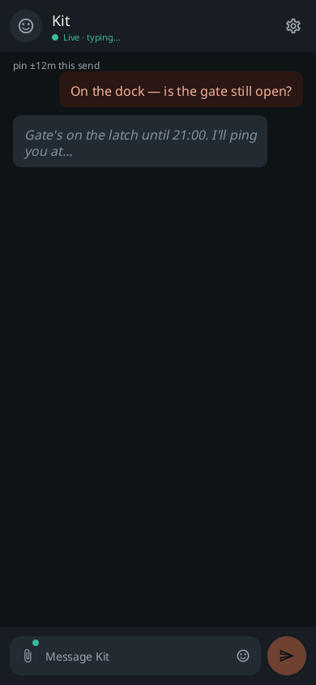

#  gantry-cab

<p align="center">
  
</p>

<p align="center">
  <a href="https://github.com/shotah/gantry-cab/actions/workflows/ci.yml"></a>
  <a href="https://github.com/shotah/gantry-cab/actions/workflows/ci.yml"></a>
  <a href="https://github.com/shotah/gantry-cab/releases"></a>
  <a href="LICENSE"></a>
</p>

The in-car mouth for [gantry-pendant](https://github.com/shotah/gantry-pendant).
Pendant is the handheld. Cab is the seat. Same mailbox. Same crane.
Nothing inbound on the Mini.

```text
car / phone APK  →  gantry-pendant Worker (Durable Object)  ←  crane (outbound)
```

Android Auto reads Kit aloud and stuffs spoken replies into
`RemoteInput`. This app turns that string into an `inbound` frame.
It does not wrap the Vinext PWA. It does not run React Native.

<p align="center">
  
  &nbsp;
  
  &nbsp;
  
</p>

Every screen: [docs/screens.md](docs/screens.md). `make shot` reshoots.
Phone + Auto install: [docs/sideload_to_android.md](docs/sideload_to_android.md).
Open work: [docs/todo.md](docs/todo.md).

## This is not

- A Chrome Install / TWA / PWA in the dash. Auto will not project that.
- A Play Store listing (sideload or Play **internal** testing).
- A second mailbox. Forking the Worker is how you get two rooms.

## Talks to pendant

| Call | What |
| --- | --- |
| `GET /api/auth/config` | spike vs Google |
| `POST /api/auth/token` | `{ id_token, nonce }` → session JWE |
| `GET /api/auth/me` | `Authorization: Bearer <jwe>` → `{ sub, email, cranes }` |
| `GET /ws/<slug>?role=phone` | WebSocket. Header is the JWE (Google) or the spike secret |

Spike walk: emulator → `http://10.0.2.2:3000`, paste the mailbox
secret. Production: copy pendant’s **Web** client id into
`CAB_GOOGLE_WEB_CLIENT_ID`, and create a **new Android** OAuth client
(package `com.gantree.cab` + SHA-1, no redirect URI). Cab POSTs the
token to `/api/auth/token` — Google is not given a Cab callback.

## Hello

Android Studio works. So does make, same shape as
[ai-gantry](https://github.com/shotah/ai-gantry):

```bash
make test            # script tests + JVM unit tests
make lint            # Android lint
make coverage        # JaCoCo + 70% bar (mailbox + mouth)
make check-app       # lint + test + coverage (one Gradle invocation)
make install-hooks   # pre-commit: tests; pre-push: lint + coverage
make watch           # continuous mailbox JVM tests
make shot            # phone + Auto PNGs → assets/docs
make build           # debug APK
make apk             # sideload APK (GitHub Release uses this)
make release         # bump patch, tag, push (GitHub Release + APK)
make release DRY_RUN=1
```

Needs JDK 21 and an Android SDK (`local.properties` `sdk.dir`, or
`ANDROID_HOME`). Script tests (`make test-scripts`) do not. Nested checkout under
gantree (`repos/gantry-cab`), own git remote, same pattern as
`repos/ai-gantry`. Walk: [docs/setup.md](docs/setup.md).

```bash
# on the pendant checkout
npm run dev          # 127.0.0.1:3000 — emulator reaches it as 10.0.2.2
```

In cab: origin `http://10.0.2.2:3000`, slug `kit`, spike secret from
`.dev.vars`. Type. Reply in the crane tab. Auto: Desktop Head Unit, or
a real head unit with Android Auto → Developer settings → Unknown
sources.

Google Sign-In needs **two** OAuth clients in pendant’s GCP project:
the existing **Web** client id in `CAB_GOOGLE_WEB_CLIENT_ID` (copied
from pendant — that is the token `aud`), and a **new Android** client
(`com.gantree.cab` + this APK’s SHA-1 from the GitHub Release notes).
The Android client has **no** redirect URI. Cab never opens Chrome;
it POSTs the ID token to the mailbox `/api/auth/token`. Walk:
[docs/setup.md](docs/setup.md#google-production-worker). GitHub
Release bakes the Web id from Actions secrets. The public tree only
has fake example hosts.

## Auto

Notification messaging (`MessagingStyle` + reply + mark-as-read) is
the heads-up while maps or music are up. Opening Cab in the Auto app
list is a `ConversationItem` (Car API 7): Auto's Reply button uses
host voice, not Google Assistant. We send the transcript as `inbound`.

Foreground socket while the app is signed in. FCM lock-screen when
the process is dead is later — same later as pendant Web Push.
