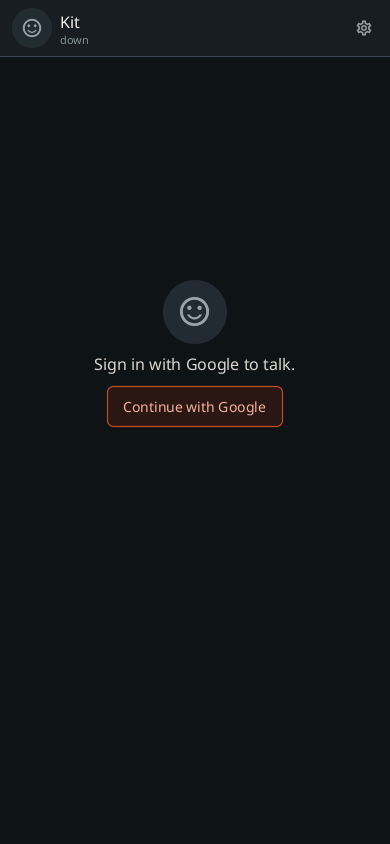
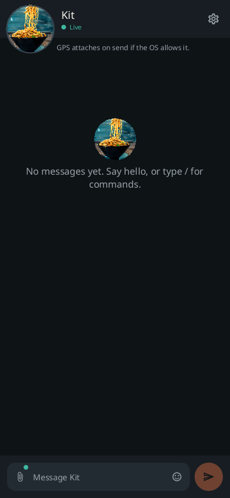
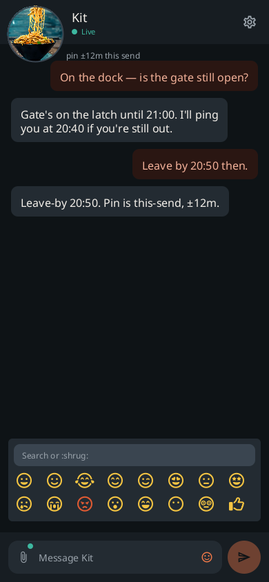
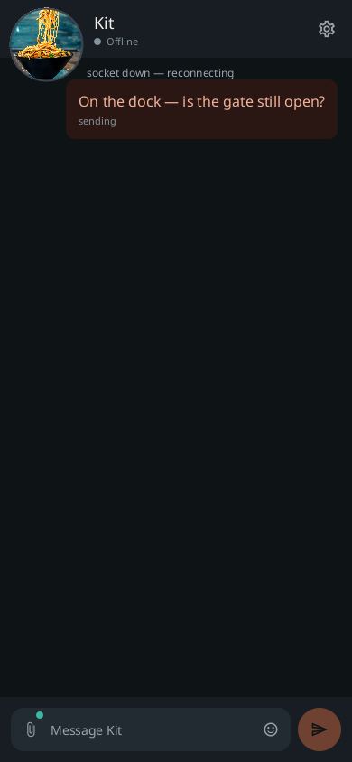
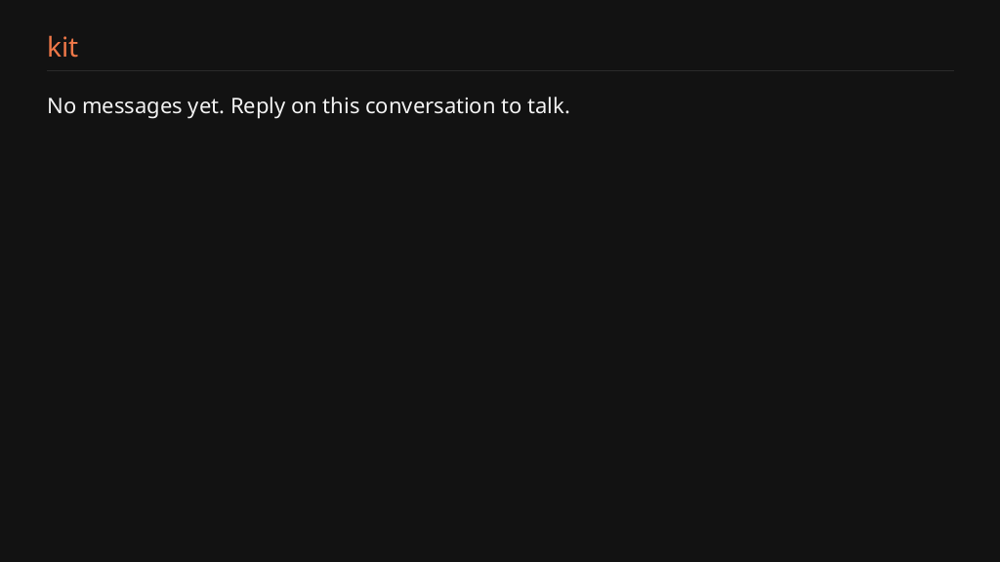

# Screens

What the mouth looks like. Reshoot: `make shot` (JVM paint, no emulator).
Debug APK also paints these scenes: tap the Dev chips, or

```bash
adb shell am start -n com.gantree.cab/.MainActivity --es sample thread
```

Samples are canned Ada/Kit turns — not a live crane. Release builds ignore
`sample` extras. Boom is the default mood; Lamp and Paper are the other two
README themes. The rest of the catalog lives in Settings.

---

## Phone

<p align="center">
  
  &nbsp;
  
  &nbsp;
  
  &nbsp;
  
</p>

<p align="center">
  
  &nbsp;
  
  &nbsp;
  
  &nbsp;
  
</p>

<p align="center">
  
  &nbsp;
  
  &nbsp;
  
  &nbsp;
  
</p>

## Android Auto

ListTemplate + `ConversationItem` stand-in (DHU adds Reply / Play).
Voice is Auto's host STT, not Assistant.

<p align="center">
  
  &nbsp;
  
</p>

| Shot | Sample | What it is |
| --- | --- | --- |
| `phone-unsigned` | `unsigned` | Google door. Avatar + cog. |
| `phone-empty` | `empty` | Live, nothing said yet. |
| `phone-thread` | `thread` | Ada ↔ Kit. Boom. |
| `phone-stream` | `stream` | Draft bubble + `Live · typing…`. |
| `phone-photo` | `photo` | Hatch photo in a you-bubble. |
| `phone-down` | `down` | Socket down; local echo still `sending`. |
| `phone-settings` | `empty` | Settings: origin, slug, theme catalog, font, photo size, follow Kit, backdrop, Test car voice. |
| `phone-emoji` | `thread` | Emoji picker over compose. |
| `phone-attach` | `thread` | Paperclip menu: photo, camera, commands, GPS, pin. |
| `phone-draft` | `thread` | Staged photo on compose: thumbnail + Remove; Send carries caption + JPEG. |
| `phone-thread-lamp` | `thread` | Same thread, Lamp. |
| `phone-thread-paper` | `thread` | Same thread, Paper (daylight). |
| `auto-empty` | `empty` | Auto list, empty. |
| `auto-thread` | `thread` | Auto list, last six turns. |
